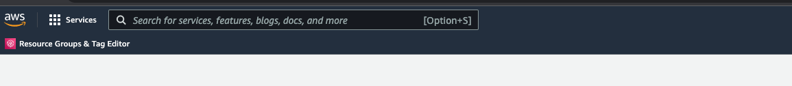
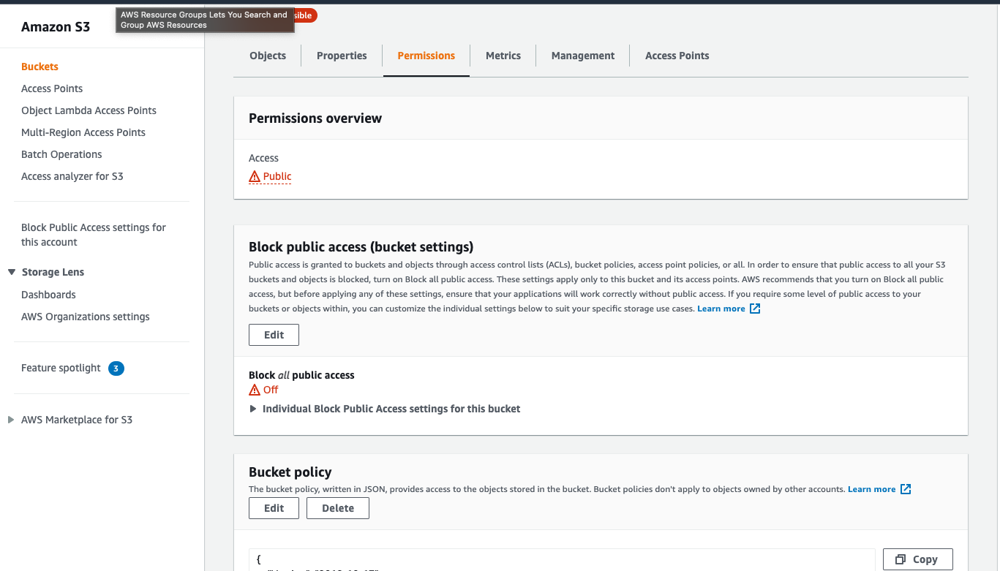

# [MPT GYM](https://ms4-mpt-gym.herokuapp.com/)

MPT Gym is anEcommerce site for a personal training company.  It was created for a milestone project 4 as part of Code Insitute’s full stack development course.

This fully interactive and responsive website was build and developed using HTML, CSS, Python on a Django framework with a little JavaScript thrown in.


View this project live here
[MPT GYM](https://ms4-mpt-gym.herokuapp.com/)

## Table of Content

- [UX Design](#ux-design)
    - [Strategy](#strategy)
    - [Goals](#goals)
- [Design](#design)
    - [Wireframes](#wireframes)
    - [Database Structure](#wireframes)
    - [Typography](#Typography)
    - [Color Scheme](#color-scheme)
    - [Image](#image)
- [Features](#features)
    - [Layout](#layout)
    - [Features to implement in the future](#features-to-implement-in-the-future)
- [Technologies used](#technologies-used)
- [Testing](#testing)
- [Deployment](#deployment)
- [Credits](#credits)
    - [Acknowlegements](#acknowlegements)
    - [Inspiration from website](#Inspiration-for-website)
    - [Code](#code)

# UX

## Strategy

As a personal trainer, I wanted to build a fictional personal training website that also has an Ecommerce store to allow the company to sell personal trainer packages and as well giving the company’s client base the opportunity to purchase products that the company promotes.

## Goals

#### Owner goal

- To increase an online presence.
- To drive and connect to members.
- To convert new customers.
- To add a new way of building revenue in the company.
- 

#### User goals

- To access the company’s site across different devices.
- To find a gym or personal trainer in their cities or towns.
- To buy products/services from the company without having to go to the premises.
- To contact the gym with questions.

## **User stories:**

- **Website experience**

    - Would like an easy site to navigate and also simple for the user to understand what they are looking at or for.
    - Would like a responsive website that can be accessed on different devices.

-  **Club / Personal Trainer experience**

    - Would like to read about the club's information and personal trainers working in a specific club.
    - Would like to read about the personal trainer specialty and contact information.
    
- **Shopping experience**

    - Would like to have an overview of the product on offer.
    - Would like to sort products out by specific list.
    - Would like to view products by category and specific requests to find things I'm looking for.
    - Would want to view basic information about the product before clicking on an item.
    - Would like to get further information about the product once I click on the item.
    - Would like to select the quantity of the item I would like to order.

- **Checkout and shopping bag experience**

    - Would like to review my bag items to change or adjust as needed.
    - Would like to see the overall grand total of my shopping bag.
    - Would like a safe and secure way to enter payment information with a form that is easy to follow and understand.
    - Would like a way to save my payment details to make my next purchase quick and easy.
    - Would like to receive a confirmation on my purchase order.

- **Contact**

    - Would like a way to contact the owner of the site to make queries or inquiries from things like orders to questions about personal trainers and clubs.

- **Registratinon and Profile**

    - Would like to register for an account to save my payment details safely and securely.
    - Would like to edit my profile page to keep my contact information up to date.
    - Would like to login and out of my profile safely.
    - Would like a way to reset my password if I forgot my password.
    - Would like to review my order history.
    
- **Site Management**

    - Would like to add items to the site collection.
    - Would like to edit individual items to keep the website up to date.
    - Would like to delete specialty items that will no longer be available on the site.
    
## Scope

- Responsive interface.
- Simple menu.
- Simple search function.
- Display search results.
- Login and sign up page.
- A user dashboard.
- Display club / personal trainer / product
- Display shopping cart
- Update/remove quantities for items in cart
- Add / edit delivery information 
- Add / edit / delete function of products
- A way to contact the owner.
- Log out

#### **Functional requirement for the platform.**

- Sign up form with email address and password.
- Be able to login
- Be able to view profile page/dashboard.
- Able to run search events by using keywords.
- Display product.
- Be able to add / edit / delete a products.
- To be able to create/view/edit/delete shopping bags.
- To be able to process orders and payments.
- To be able to store images of products added to the collection.
- Able to contact 
 the owner.
- Page 404 Not Found.
- Page 500 Internal Server Error page.

#### **Functional requirement for the platform.**

- To message a personal trainer through your profile page.
- To keep track of your personal trainer/massage session clips.
- To be able to have your personal trainer load your workout program to your profile.
- Admin management to update workout class schedule.

## Building Constraints

- The owner is building the site for the first time and is still learning Python, Django. The lack of knowledge could hinder me from fulfilling the overall look and features on this platform.
- Lack of time: to implement features due to learning new technical skills. Full-time work and two kids (one being 8 months).
 
## Structure

- Header: Search function, logo and account icon, and bag icon.
- Navbar: navigational links with the collapsible menu.
- Homepage: Hero image, information about the company, sign up button and find a trainer.
- Club page: Display clubs details and personal trainer working at each club.
- Product page: Display item on the site.
- Shopping bag: Display items that are/added to the bag.
- Checkout page: Display item, the form to buy items.

# Design

### Wireframes

I used mockup [mockflow.com](https://www.mockflow.com/) 


- [Wireframes Download PDF](documentation/design/wireframes/home-page.pdf)
- [Wireframes Download PDF](documentation/design/wireframes/club-page.pdf)
- [Wireframes Download PDF](documentation/design/wireframes/club-detail-page.pdf)
- [Wireframes Download PDF](documentation/design/wireframes/product-page.pdf)
- [Wireframes Download PDF](documentation/design/wireframes/product-detail-page.pdf)

### Database Structure

Project using SQLite for development and then Postgres when Hosted by Heroku.  This is the first draft of the project.

A pdf version of the feature trade-off can been see [here](documentation/design/database-structure/db-database-excel.pdf)

A pptx version of the feature trade-off can been see [here](documentation/design/database-structure/db-database.pptx)


### Typography

[Google Fonts](https://fonts.google.com/)

I chose to use Bungee Outline for the Logo and I am keeping the font simple with sans-serif.

### Color Scheme

Theme color is just a simple three colors, dark blue, orange touches, and white.  The orange is to give a pop of color when needed.


### Image

Image details and information about the images can be found here in [this document](documentation/feature-images/image.md).


# Features

- #### Navbar
    - The navbar will be fixed to the top of the screen.  This gives the user a fixpoint the navigate to.
    - The search bar at the top right first place a user will look at, this will help the user to find products faster.
    - The navbar will have the Company Logo. This will not be displayed on the smaller screens.
    - My account icon is always in the same place top right of the navbar, which gives the user a focus point.  This will also change when a user login or registers.
    - Shopping cart is next to the account icon which will also remain in the navbar on different screen sizes.

- #### Home page / Landing page
    - Will have a hero image to draw attention to the user's eyes.
    - Next to the hero image is information about who the company is and a button to link the user to the different clubs in the company.
    - Under the first hero image, is a call to action to get the user to sign up.
    - After the call to action writing is some information about personal trainers and a link to check out each personal trainer working in each club.
    - Next to the personal trainer section is another hero image which is just to break up the page.  This will disappear on smaller screens.

- #### Login / Sign Up page
    - This is done through the My Account icon in the top right of the navbar.  Once login or sign up, the dropdown menu will change to a logout and profile navigation menu.

- #### Log Out
    - Logging out in the same place as the login menu. The user will be taken to a page to confirm log out and then my account menu will change back to the login and register menu.

- #### Profile page
    - Once the user registers or login they will have access to their profile page.
    - This gives the user any order history information and allows the user to enter delivery information to be saved.

- #### Product page
    - The page will display a list of items and services available on the site for purchasing.
    - The items will display an image, name, and price clearly for the user to see.
    - Click on the image of the item will allow the user to navigate to the product detail page which will show the user more information about the product.
    - A superuser/admin user can edit or delete a product straight from this page will the button under the image.

- #### Product detail page
    - This will display more information about the item and allow the user to add the item to the shopping bag for purchase.
    - The user can adjust the quantity of a product they are purchasing.
    - The user can also leave a review or read any review left on the product they are buying.
    - A superuser/admin user can edit or delete a product straight from this page with the buttons.

- #### Shopping Cart / Bag
    - The cart will show all items to the user that have been added to the cart. E.g image, name, size, price subtotal, and grand total.
    - The user can change the quantity of any item in the cart as well as delete the item completely.
    - At the bottom of the page is the grand total, delivery cost, and two-button - "Keep on Shopping" and "Checkout".

- #### Checkout page
    - If the user is login and has to save delivery information from before the form will auto-complete. If not the user can enter the detail and then click the checkbox to save the information for next time.
    - The is a brief summary of the order and cost.
    - Payment is done by Stripe so everything is safe and secure. This allows the user to enter in card detail with prompts and notifications if the user enters anything wrong.
    - A complete order button at the bottom of the page.

- #### CRAD Features
    - Superuser/admin users can enter any new product into the list of items to be sold.  This is done in my account menu at the top of the page in the navbar.
    - The superuser will have a form to fill in with prompts and notifications to help the user fill the form in correctly.
    At the bottom of the page is the complete adding a product button.

- ### Future Features
    - To message a personal trainer through your profile page.
    - To keep track of your personal trainer/massage session clips.
    - To be able to have your personal trainer load your workout program to your profile.
    - Admin management to update workout class schedule.

# Languages

- [HTML5](https://en.wikipedia.org/wiki/HTML5) 
    - used to structure the page.
- [CSS3](https://en.wikipedia.org/wiki/Cascading_Style_Sheets) 
    - used to add style and look of the page.
- [Javascript](https://en.wikipedia.org/wiki/JavaScript) 
    - used to build interactive elements of the website/page.
- [Python](https://en.wikipedia.org/wiki/Python_(programming_language))
    - Python is an interpreted high-level general-purpose programming language.

# Database

- [db.sqlite3](https://www.sqlite.org/index.html)
    - A SQLITE3 file is a database file stored in the SQLite 3 format. It contains structured data records, which contain data types and values. SQLITE3 files are often used for storing embedded SQL-based databases for iPhone apps and other mobile applications.
- [Postgres](https://www.postgresql.org/)
    - PostgreSQL also known as Postgres, is a free and open-source relational database management system (RDBMS) emphasizing extensibility and SQL compliance.

# Technologies, Libraries and Frameworks Used

- [Bootstrap 5:]()
    - to help build the layout of the page with the use of the library.
- [Font Awesome:](https://fontawesome.com/) 
    - a library full of icons.
- [Google Fonts:](https://fonts.google.com/)
    - a library full of fonts.
- [Jquery:](https://en.wikipedia.org/wiki/JQuery) jQuery is a fast, small, and feature-rich JavaScript library.
- [Git:](https://git-scm.com/) 
    - Version control from gitpod, save, commits, and push code to Github.
- [GitHub:](https://github.com/)
    - Live site to save code.
- [GitPod:](https://www.gitpod.io) 
    - Local repository to read the develop code.
- [Heroku](https://www.heroku.com/home)
    - Heroku is a cloud platform as a service supporting several programming languages. One of the first cloud platforms, Heroku has been in development since June 2007
- [Django](https://www.djangoproject.com/)
    - Django is a high-level Python web framework that encourages rapid development and clean, pragmatic design. Built by experienced developers, it takes care of much of the hassle of web development, so you can focus on writing your app without needing to reinvent the wheel. It’s free and open source.
- [Amazon Web Services (AWS)](https://aws.amazon.com)
    - AWS (Amazon Web Services) is a comprehensive, evolving cloud computing platform provided by Amazon.
- [Amazon Web Services S3](https://aws.amazon.com)
    - Amazon Simple Storage Service (Amazon S3) is an object storage service offering industry-leading scalability, data availability, security, and performance.
- [Amazon Web Services IAM](https://aws.amazon.com)
    - Identity and access management (IAM) is a framework of business processes, policies and technologies that facilitates the management of electronic or digital identities.
- [Stripe](https://stripe.com/en-gb-se)
    - Stripe is an online payment processing and credit card processing platform for businesses. When a customer buys a product online, the funds need to be delivered to the seller; Insert Stripe. Stripe allows safe and efficient processing of funds via credit card or bank and transfers those funds to the sellers account.
- [mockflow.com](https://www.mockflow.com/) 
    - Used to design my wireframes.
- [DB Diagram](https://dbdiagram.io/home)
    - Database diagrams graphically show the structure of the database and relations between database objects. You can generate a diagram for a data source, a schema, or a table. To create relations between database objects, consider using primary and foreign keys
- [W3C CSS Validator](https://validator.w3.org) 
    - Used to check of errors in HTML code.
- [W3C HTML Checker](https://validator.w3.org)
    - Used to check of errors in CSS code.
- [Am I responsive](http://ami.responsivedesign.is) 
    - is a high fidelity responsive design tool for previewing your site across a variety of popular devices.
- [W3C Spell Checker](https://www.w3.org/2002/01/spellchecker) 
    - This tool allows you to check the spelling of a web page.
- [Chrome Development Tools](https://developer.chrome.com/docs/devtools/)
    - Web developer tools built directly into the Google Chrome browser. To help developers diagnose problems as they work on projects.
- [Responsive viewer](https://chrome.google.com/webstore/detail/responsive-viewer/inmopeiepgfljkpkidclfgbgbmfcennb?hl=en) 
    - To test your website responsiveness across different devices.
- [Wave Accessibility](https://wave.webaim.org) 
    - helps you make their web content more accessible to different people with disabilities.
- [Google lighthouse](https://developers.google.com/web/tools/lighthouse) 
    - Check your site Performance, Accessibility, Best Practices, and SEO and give it a rating out of a 100.

### Media

- [figma](https://www.figma.com) 

# Testing User Stories

- ## User Stories Testing can be read [here](documentation/testing/testing-user-stories.md).

# Issues

- ## Issues process can be read [here](documentation/testing/testing.md).

# Performance Testing
- Lighthouse
- Code Validation
    - HTML
    - CSS
    - JHints

- ## Performance Testing process can be read [here](documentation/testing/performance-testing.md).

# Deployment

Repository is hosted on Github and deployed on Heroku. I developed the website using the Code Institute template on Gitpod, and push to GitHub by the uses of the Gitpod terminal.

### Other platforms used

- An account with [Heroku](https://www.heroku.com/home)
    - Heroku is a cloud platform as a service supporting several programming languages. One of the first cloud platforms, Heroku has been in development since June 2007
- An account with [Amazon Web Services (AWS)](https://aws.amazon.com)
    - AWS (Amazon Web Services) is a comprehensive, evolving cloud computing platform provided by Amazon.

## Cloning the Project

When you finish logging into Github, navigate to the repository page, and select MS3-recipes. Above the file list, click on the Code button next to the Gitpod button (green button). Copy the URL. Open your terminal. Change the working directory to the location where you want the cloned directory. Paste the URL after you have type git clone. eg $ git clone https://github.com/Username/repository-name Press enter and this will create a local clone.

Or 

## Download zip files

Create a repository in GitHub. Unzip the folder Upload the files into your workspace You can read more about this in the link below.

More information on cloning repository:
[Github Information](https://docs.github.com/en/github/creating-cloning-and-archiving-repositories/cloning-a-repository)


## Forking the Project

When you finish logging into Github, navigate to the repository page, and select MS3-MPT-Recipes. At top right of the page click on the fork button.

More information on fork repository:
[Github Information](https://docs.github.com/en/github/getting-started-with-github/fork-a-repo)


## Set up the local environment

Once you open up the project in Gitpod you need to install the requirements for the project to do this in the terminal `pip3 install r requirements.txt`


Check or enter in any environment variables you will need in your settings in Gitpod


- Then you need to migrate the project `python3 manage.py makemigrations` and then `python3 manage.py migrate`

- Once this is done you can start loading the json files. `python3 manage.py loaddata <name of file>`

- Best way to upload the json files is (could end up with an issue if you upload in a different order): 

    ### Clubs fixtures
    - city_or_town.json,
    - clubs.json,
    - personal_trainer.json

    ### Then Product fixtures
    - categories.json
    - tags.json
    - products.json

Let's create a superuser `python manage.py createsuperuser`

Username: admin. You will then be prompted for your desired email address:
Email address: admin@example.com. ...
Password: ********** Password (again): ********* You should see Superuser created successfully if everything is working.


## Deployment on Heroku

Log onto Heroku and create an app by clicking on the new app button.


- You need a unique name for your application.
 
- Now select the region that is closest to you.

- You need to set up a database so click on the resource tab and enter in [Postgres](https://www.postgresql.org/) into the add-ons input box.  Then click on Heroku Postgres.


Select the free Hobby Dev plan.

- In Gitpod you need to login to heroku: 
    - heroku login -i
    - enter your email
    - password

Next we need to temporarily disable collectstatic file by type:  
    `heroku config:set DISABLE_COLLECTSTATIC=1  --app <app-name>` 

In Django setting add allowed host to gain access to heroku


Now Git add/commit and push your settings to Github and then using: `git push heroku master` to deploy to Heroku.  Maybe you need to do this remotely with `heroku git:remote -a <app name>` then try and push to heroku again wtih `git push heroku master`.

Let's setup it to automatically deploy to Heroku when we push to Github.

- In Heroku click Deploy tab and then click on connect to Github in the Deployment method selection.


- Now find your repository and then click connect.


When that is done we will enable automatic deployment by clicking on the button.


Now enter all your Config Vars you need into Heroku settings.  Click on the settings tabs and navigate to the Config Vars and enter all the environment variables you will need.


## AWS S3 Configuration

All static and images are hosted on Amazon Web Services.

- Open up a account with AWS
- Once you are login to your account open up S3 to find this use the search bar and type in S3 and S3 management will appear, click on it.



- Now we need to create a new bucket.
    - click on create bucket and name it the same as your heroku app name.
    - select the region close to you.
    - Uncheck block all public access as we need to allow public access to our static files.
    - Click on acknowledge the bucket will be public.
    - Then click Create bucket button.


Your bucket should be created now:


Click on this bucket as we need to set a few settings. Go to the properties tab and then click on
edit static website hosting.


- Enter `index.html` in index document and `error.html` in error document.

In the permissions tab we need to make 3 changes.
-   Cross-origin resource sharing (CORS configuration):
    - Paste in
    ```
    [
    {
        "AllowedHeaders": [
            "Authorization"
        ],
        "AllowedMethods": [
            "GET"
        ],
        "AllowedOrigins": [
            "*"
        ],
        "ExposeHeaders": []
    }
    ]
    ```

- In the bucket Policy tab select policy generator to create a security policy for this bucket.

- Principal:
    - Actions: GetObject
    - ARN: Copy the ARN from the Bucket Policy tab and paste it here.
    - Click Add Statement then Generate Policy.
    - Copy the new policy and paste into the Bucket Policy editor.
    - To allow access to all resources add a "/*" onto the end of the Resource key value.
    - Save the new policy.

- Last thing in this section is to go to Access Control List (ACL):
    -   On the "Everyone (public access)" line check the List checkbox and click Save changes.

Now we need to find the Identity and Access Management (IAM) so in the search bar type IAM and click on this to load up the page.


We need to create a group so click on User Group. Enter a group name then scroll to the bottom and click Create group. Don't worry about anything else just click through.

Let create a Policy, click on the Policies button then create policy button.


Go to the json tab and select import managed policy. Now search for the `AmazonS3FullAccess` policy and import this. 

- We need the ARN from the S3 bucket.
    - So click on the S3 bucket and go to the Permissions tab.
    - Click on edit Bucket Policy and copy the ARN: code.




Now back in Policies paste in the ARN code in were the "Resource": [] section.

    ```     
        "Resource": [
            "arn:aws:s3:::s3-bucket-name",
            "arn:aws:s3:::s3--bucket-name/*"
        ]
    ```

Click review Policy button, give it a name and description and then click create policy.

Go to the User Group tab and click on the group name file.


Click attach policy, search for the name of the policy you created. Select it and click attach policy.

Last we need to create a user to put in the group.  Go to the user tabs and click it. On the user page, click add user and give the user a name.  Give them programmatic access. Click next and then add the user to the group. Just click through to the end.

Download the CSV file this contains the user access key and secret access key which will be used for authentication in Django.

In gitpod terminal we need to connect Django to S3 bucket. Install 2 packages:
`pip3 install boto3`,
`pip3 install django-storages`

Freeze the requirements:
`pip3 freeze > requirements.txt`.

In django settings add `storages` in installed apps.


Next add AWS environ to django settings, see image below. And then add config vars to Heroku.


Now create a file call custom storages and import both our settings from django.cof and well as the s3boto3 stprage class:
```
    from django.conf import settings
    from storages.backends.s3boto3 import S3Boto3Storage


    class StaticStorage(S3Boto3Storage):
        location = settings.STATICFILES_LOCATION


    class MediaStorage(S3Boto3Storage):
        location = settings.MEDIAFILES_LOCATION
```

Last thing to do is to 
- git add .
- git commit
- git push

# Credits

[Django-doc](https://docs.djangoproject.com/en/4.0/topics/email/) : contact us form

[CodeInstitue](https://codeinstitute.net/se/) : template of the site, and code!

## Inspiration for Website
https://www.zestwellnessnutrition.com/purchase-new/60-min-virtual-11-coaching-session

## Acknowledgments

- My Wife: for her support and looking after the kids.
- My Daughter and Son: For the understand that daddy has to study.
- New Mentor: Felipe Souza Alarcon for his feedback and help.
- Code Institue: for the knowledge you gave me.
- W3School: For helpful reminders.
- [Stackoverflow](https://stackoverflow.com)
- Product image and information sourced from [MyProtein.com](https://www.myprotein.se/)

## Code

- Code Institute [Boutique-ado](https://github.com/Code-Institute-Solutions/boutique_ado_v1/tree/933797d5e14d6c3f072df31adf0ca6f938d02218)
- Django Doc [Django-Doc](https://docs.djangoproject.com/en/4.0/topics/email/)